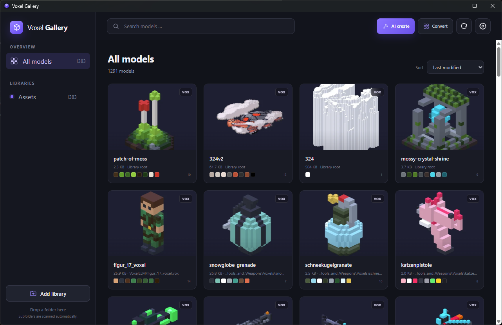
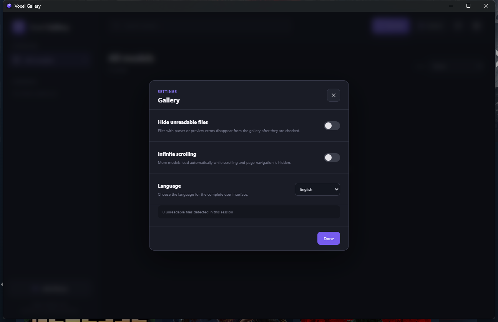
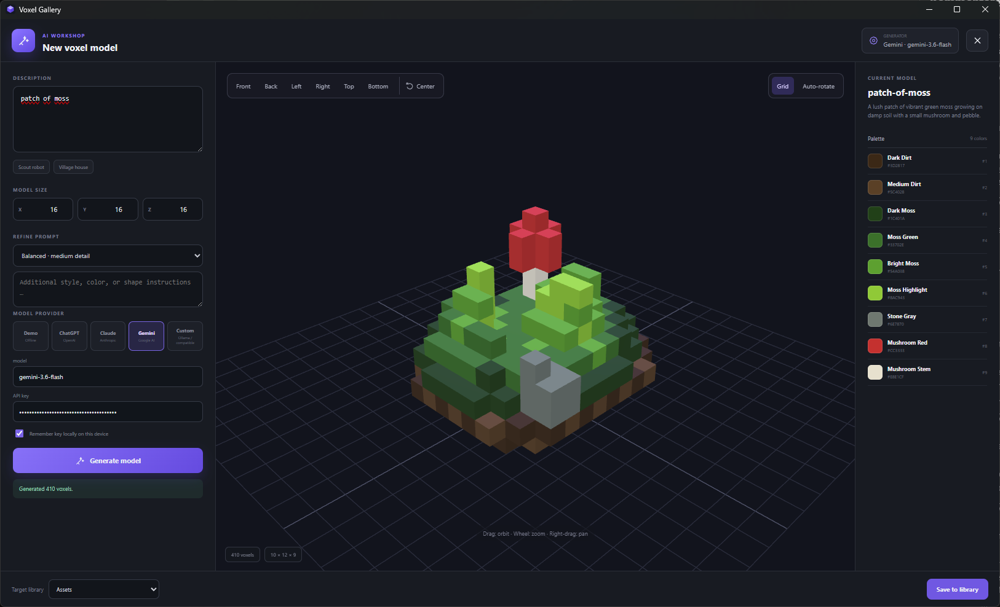

<div align="center">

# Voxel Gallery

**A fast, local-first Windows library, viewer, generator, and conversion workspace for MagicaVoxel `.vox` files.**

[](https://github.com/id3vi5er/VoxelGallery/releases/latest)


[Download](https://github.com/id3vi5er/VoxelGallery/releases/latest) · [Features](#features) · [AI generation](#ai-voxel-generation) · [Landscapes](#procedural-landscapes--tree-generator) · [Converters](#optional-converter-integrations) · [Build from source](#build-from-source)

</div>



Voxel Gallery turns folders full of voxel assets into a visual, searchable library. Add any number of Windows folders, let the app generate thumbnails, inspect every model in an interactive 3D viewer, explore its palette, generate new assets with an LLM, build complete procedural landscapes, or convert existing source files through optional third-party tools.

## Download

Open the [latest GitHub release](https://github.com/id3vi5er/VoxelGallery/releases/latest) and choose one of the following:

- **`Voxel-Gallery-Setup-x64.exe`** — recommended installer for Windows 10/11 x64.
- **`Voxel-Gallery-Portable-x64.exe`** — standalone executable; no installation required.

Windows WebView2 is required. It is already present on current Windows 10 and Windows 11 installations. The application itself opens without a terminal window.

## Features

### Library and gallery



- Add multiple Windows folders as persistent libraries.
- Drag folders or individual `.vox` files onto the window.
- Scan nested folders recursively without copying or modifying source files.
- Generate thumbnails in the background and cache them locally in IndexedDB.
- Search by file name or relative path.
- Sort by name, modification date, file size, number of used colors, or dominant hue.
- Pick a reference color with the native color picker and rank models by perceptual palette similarity (OKLab).
- Hide unreadable or unsupported files from the gallery in Settings.
- Browse large collections in bounded pages of 96 cards or enable infinite scrolling in Settings.
- Switch the complete interface between German and English at runtime; the selection persists locally.

### Viewer and palettes

- Orbit, pan, and zoom around a model with Three.js.
- Switch to front, back, left, right, top, or bottom views.
- Toggle the grid and automatic rotation.
- Inspect every used palette color, hexadecimal value, and voxel count.
- Parse MagicaVoxel `SIZE`, `XYZI`, `RGBA`, `PACK`, `nTRN`, `nGRP`, and `nSHP` chunks.
- Render only visible surfaces, avoiding internal faces.

### Large-file safety

VOX data is transferred through binary IPC instead of JSON arrays. Parsing and greedy surface meshing run in a Web Worker, repeated models use GPU instancing, and compact mesh attributes keep the UI responsive while large previews are prepared. Thumbnails automatically use a stable surface-colored level of detail when an exact mesh would be too large; the interactive viewer offers the same mode after an exact preview reaches its safety budget.

The native reader accepts individual files up to 512 MB. A model is limited to 20 million voxel records, while generated mesh buffers have a 128 MB safety budget. Occupancy grids are bounded per unique model and released between models instead of accumulating across the whole scene.

## AI voxel generation



*The integrated AI workspace with a generated example voxel model, interactive preview, and model palette.*

The built-in generator creates a model, previews it in the same 3D viewer, shows its palette, and saves it directly into a selected library.

Available providers:

- Offline deterministic demo generator — no account or network connection required.
- OpenAI Responses API with structured output.
- Anthropic Messages API.
- Google Gemini `generateContent` API.
- Custom OpenAI-compatible endpoints, including local Ollama-compatible services.

You can set exact X/Y/Z dimensions from 1 to 64, choose the amount of detail, and add style, color, or shape instructions to refine the prompt. Generated output is schema-validated and limited to 50,000 voxels before it is exported as a MagicaVoxel v150 file.

API keys are only sent to the selected provider. A key is stored only when **Remember API key on this device** is enabled, and then only in the local WebView storage on that computer. Keys are never written into the repository, project files, or generated VOX files.

## Procedural landscapes — Tree Generator

The **Landscape** workspace builds complete `.vox` terrains from algorithms and adjustable variables. It runs entirely offline and deterministically: the same seed and the same settings always produce byte-identical output.

### Terrain

Six height field algorithms, each fed by seeded value noise with configurable octaves, persistence, lacunarity, and domain warp:

| Algorithm | Method |
| --- | --- |
| Hills | fractal Brownian motion |
| Mountains | ridged multifractal |
| Plains | damped low-amplitude noise |
| Islands | fBm with a radial falloff |
| Canyon | inverted ridges with plateau terracing |
| Dunes | wave field modulated by noise drift |

The field is normalized across its full range, smoothed, redistributed through a height curve, optionally terraced, and finally shaped by thermal erosion passes. Materials are chosen per column from height, slope, and a separate moisture field: deep water, water, sand, soil, three grass shades, gravel, stone, and snow above the snow line. A configurable crust depth keeps the model hollow while automatically reaching below the lowest neighbor so cliff faces stay closed.

### Trees

Five tree algorithms, plus a mixed forest mode that picks per location from altitude and proximity to water:

- **Recursive branching** — parametric 3D branching with branch count, spread angle, and length falloff per level.
- **L-system** — 3D turtle interpretation of a rewritten string with yaw, pitch, roll, and a branch stack.
- **Conifer** — a straight trunk with stacked, drooping branch whorls.
- **Palm** — a curved trunk with arching fronds.
- **Dead wood** — recursive branching without foliage.

Every skeleton is generated in relative units, scaled to the wanted tree height, and then rasterized with thickness-aware branches and thinned-out crowns. Placement uses a jittered grid filtered by slope, tree line, ground material, and the moisture field.

Boulders, grass tufts, and flowers can be scattered on top, and a season setting (spring, summer, autumn, winter) recolors foliage, grass, and blossoms.

### Scale

A voxel can represent anything from **10 m down to 0.1 m**. All lengths in the workspace are metric — feature size, crust depth, beach width, tree height, crown radius, and trunk radius — and are converted to voxels for the selected scale. The same 96³ grid is therefore either a 96 m landscape with 8–16 m trees, or a 24 m clearing in which those same trees are 32–64 voxels tall.

Seven presets (forest valley, high alpine, tropical island, desert dunes, canyon, autumn woods, winter taiga) provide starting points, and the preview updates automatically while you move the sliders. Maps are limited to 256 voxels per axis because VOX stores coordinates as single bytes; the report panel shows the voxel count, visible faces, and resulting file size before saving.

## Optional converter integrations

Voxel Gallery does **not** bundle, redistribute, or commit FileToVox, MeshToVox, or the supplied voxel-llm source project. These remain separate third-party tools with their own licenses and release channels.

### FileToVox

[FileToVox](https://github.com/Zarbuz/FileToVox) is integrated directly through its freely available original executable. Download it from the [official FileToVox releases](https://github.com/Zarbuz/FileToVox/releases), open **Convert**, and select `FileToVox.exe`. Keep the runtime files shipped with FileToVox beside the executable.

The Gallery interface exposes the supplied FileToVox 1.16 workflow:

- ASC, BINVOX, CSV, PLY, PNG, QB, SCHEMATIC, TIF, XYZ, VOX, multiple PNG layers, and recursive PNG folders.
- Original image colors and external color files.
- Height-map depth.
- Palette image, color limit, and optional quantization bypass.
- Grid size, chunk size, exterior-only excavation, and debug validation.
- Direct output into a selected Gallery library and automatic rescan after completion.
- Live completion status, conversion log, and cancellation.

FileToVox may display a Windows administrator prompt because the original converter requires elevation. Voxel Gallery therefore launches its own open-source elevated worker, passes a strictly validated option list directly to `FileToVox.exe`, captures its output, and supports cancellation. `FileToVox-GUI.exe` is neither required nor used.

### MeshToVox

[MeshToVox](https://github.com/Zarbuz/FileToVox/wiki/7.-MeshToVox) is part of the FileToVox project and is distributed through its [official releases](https://github.com/Zarbuz/FileToVox/releases). Select the local `MeshToVox.exe` from the **Convert** workspace. The adjacent `MeshToVox_Data` directory must remain intact.

Because the provided MeshToVox 2.9 package is a compiled Unity application without integration source or a documented command interface, Voxel Gallery launches its complete original interface instead of reimplementing an incomplete subset. Model loading, OBJ/FBX/glTF/STL support, textures and materials, scaling, resolution, voxelization, color controls, and VOX export therefore remain available. Save the result into a Gallery library and click **Refresh** to see it immediately.

## Usage

1. Start Voxel Gallery and choose **Add library**.
2. Select one or more folders containing `.vox` files. Subfolders are scanned automatically.
3. Click a card to open the 3D viewer. Use the palette button to inspect its colors.
4. Use **AI Create** for generated models or **Convert** for FileToVox and MeshToVox.
5. Open **Settings** to hide files that cannot be parsed safely, enable infinite scrolling, or switch between German and English.

Library paths, preferences, thumbnail metadata, optional converter paths, and remembered API keys stay in local application storage. Voxel model files remain in their original folders.

## Build from source

Requirements:

- Windows 10 or Windows 11
- Node.js and npm
- Rust with the MSVC toolchain
- [Tauri 2 prerequisites for Windows](https://v2.tauri.app/start/prerequisites/)

```powershell
git clone https://github.com/id3vi5er/VoxelGallery.git
cd VoxelGallery
npm install
npm run tauri -- dev
```

Frontend only:

```powershell
npm run dev
```

Run all automated checks:

```powershell
npm test
cd src-tauri
cargo test
cargo fmt --check
```

Create the Windows bundles:

```powershell
npm run tauri -- build
```

Build artifacts are written below `src-tauri/target/release`. Third-party converter directories are intentionally excluded by `.gitignore` and are not required to compile Voxel Gallery.

## Architecture

| Area | Responsibility |
| --- | --- |
| `src/vox` | Binary VOX parser, palette analysis, scene handling, and bounded surface meshing |
| `src/three` | Shared Three.js renderer and thumbnail pipeline |
| `src/generator` | Provider clients, schema validation, offline generation, and VOX export |
| `src/generator/landscape` | Seeded noise, terrain algorithms, tree algorithms, scatter, and metric scaling |
| `src/components` | Gallery, viewer, AI workspace, landscape workspace, settings, and converter interfaces |
| `src/lib` | Library state, Tauri IPC, scene loading, and IndexedDB thumbnail metadata |
| `src-tauri` | Safe Windows filesystem access, binary transport, HTTP relay, saving, and local tool launching |

## Privacy and security

- No telemetry or analytics.
- No cloud database.
- No model upload during normal gallery browsing.
- API traffic occurs only when you explicitly generate with a remote provider.
- `.env` files, credentials, certificates, local databases, build output, and third-party tool folders are excluded from Git.
- File and output paths are canonicalized or constrained before native operations.

## Third-party acknowledgements

- [FileToVox and MeshToVox](https://github.com/Zarbuz/FileToVox) are independent projects by their respective contributors. They are not included in this repository or its release assets.
- MagicaVoxel and the `.vox` format are associated with [ephtracy/voxel-model](https://github.com/ephtracy/voxel-model).
- Voxel Gallery uses [Tauri](https://tauri.app/), [React](https://react.dev/), and [Three.js](https://threejs.org/).

---

<div align="center">
Made for large local voxel collections on Windows.
</div>
